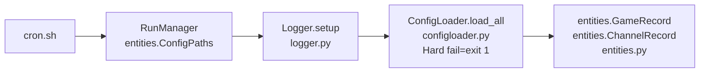

# TVHeadend M3U Processor - Implementation Status

Purpose: Living document to track the progress of implementing this project. Each section is to reflect the current status of the project  
Guidelines:

- File Hierarchy to be updated with the status of each directory/module
- Mermaid Graph tracks the business logic workflow that has been coded to this point
- Pseudo code snippets are to represent each function with a summary of actions. Do not provide actual code
- Implementation Table follows progress of implementation, adding more context to the phases
- Todo list is to track what has yet to be done

**Status:** Active | **Last Updated:** 2026-02-05 | **Progress:** 4/24 modules

## File Hierarchy (Live)

📋 File Hierarchy (Live)

```text
opt/m3uapp/
├── config/
│ ├── main/
│ │ ├── paths.json [HARD FAIL]
│ │ └── settings.json [HARD FAIL]
│ ├── m3u/
│ │ ├── m3u_sources.csv [HARD FAIL]
│ │ ├── xml_sources.csv [HARD FAIL]
│ │ ├── tvg_name_list.csv [SOFT FAIL]
│ │ ├── channel_list.csv [SOFT FAIL]
│ │ ├── exclude_channels.txt [SOFT FAIL]
│ │ ├── exclude_groups.txt [SOFT FAIL]
│ │ ├── exclude_patterns.txt [SOFT FAIL]
│ │ └── parse_exclusions.txt [SOFT FAIL]
│ ├── sports/
│ │ ├── sports_config.json [HARD FAIL]
│ │ └── api_key.txt [HARD FAIL]
│ └── epg/
│ └── category_map.json [SOFT FAIL]
├── src/
│ └── core/
│ ├── entities.py [✅ COMPLETE]
│ ├── logger.py [✅ COMPLETE]
│ ├── config_loader.py [✅ COMPLETE]
│ ├── diagnostic_collector.py [PENDING]
│ ├── lineup_manager.py [PENDING]
│ └── sports_lookups.py [PENDING]
│ ├── m3u/ [PHASE 2]
│ └── epg/ [PHASE 3]
├── logs/ [RUNTIME]
├── tvheadend/web/ [OUTPUT]
└── cron.sh [PHASE 4]
```

🔄 Workflow (Mermaid)



🛠️ Pseudocode Pipeline

`src/core/runmanager.py`

```python
src/core/runmanager.py - COMPLETE MODULE PSEUDOCODE

from logger import setup_logging, get_local_datetime, LOCAL_FORMAT
from configloader import ConfigLoader

class RunManager:
    def __init__(self, config: ConfigLoader):
        self.config = config
        tz = zoneinfo.ZoneInfo(config.settings.timezone)
        now = get_local_datetime(config.settings.timezone)
        
        self.runid = now.strftime(LOCAL_FORMAT)        # 2026-02-05_19-42-00
        self.datefolder = now.strftime("%Y-%m-%d")     # 2026-02-05
    
    def initialize_run(self) -> Dict[str, Logger]:
        """Full run setup: cleanup → directories → logging → symlink"""
        
        # 1. CLEANUP old logs
        self.cleanup_old_runs()
        
        # 2. CREATE directories
        self.setup_directories()
        
        # 3. SETUP LOGGING (requires directories)
        loggers = setup_logging(
            log_dir=self.logdir,
            run_id=self.runid,
            tz_name=self.config.settings.timezone,
            log_level=self.config.settings.loglevel
        )
        
        # 4. CREATE symlink
        self.update_current_symlink()
        
        logger = loggers["main"]
        logger.info("Run initialized", extra={
            "runid": self.runid,
            "logdir": self.logdir,
            "retention_days": self.config.settings.logretentiondays
        })
        
        return loggers
    
    def setup_directories(self):
        """logs/2026-02-05/19-42-00/{processor.log, diagnostics/}"""
        self.logdir = f"{self.config.paths.logbasedir}/{self.datefolder}/{self.runid}"
        os.makedirs(f"{self.logdir}/diagnostics", exist_ok=True)
    
    def cleanup_old_runs(self):
        """Delete folders > logretentiondays (config-driven)"""
        if not self.config.settings.cleanuponstartup:
            return
            
        cutoff = datetime.now() - timedelta(days=self.config.settings.logretentiondays)
        log_base = self.config.paths.logbasedir
        
        for date_folder in os.listdir(log_base):
            date_path = os.path.join(log_base, date_folder)
            if not date_folder.match(r"\d{4}-\d{2}-\d{2}"):  # Skip non-date folders
                continue
                
            try:
                folder_date = datetime.strptime(date_folder, "%Y-%m-%d")
                if folder_date < cutoff:
                    shutil.rmtree(date_path)
                    logger.info("Cleanup old run", extra={"folder": date_folder})
            except ValueError:
                continue  # Skip malformed folders
    
    def update_current_symlink(self):
        """logs/current → logs/2026-02-05/19-42-00"""
        current_path = f"{self.config.paths.logbasedir}/current"
        target_path = f"{self.config.paths.logbasedir}/{self.datefolder}/{self.runid}"
        
        try:
            os.unlink(current_path)
        except FileNotFoundError:
            pass
            
        os.symlink(target_path, current_path)

PUBLIC PROPERTIES
    @property
    def diagnostics_dir(self) -> str:
        return f"{self.logdir}/diagnostics"

USAGE (orchestrator.py)
    config = ConfigLoader().load_all()
    run_manager = RunManager(config)
    loggers = run_manager.initialize_run()
    logger = loggers["processor"]

```

`src/core/logger.py`
```python
src/core/logger.py - COMPLETE MODULE PSEUDOCODE

CONSTANTS
    UTC_FORMAT = "%Y-%m-%dT%H:%M:%SZ"
    LOCAL_FORMAT = "%Y-%m-%d_%H-%M-%S"     # 2026-02-05_19-41-30
    DATE_FOLDER_FORMAT = "%Y-%m-%d"        # 2026-02-05

FUNCTION get_local_datetime(tz_name="UTC") -> datetime
    tz = zoneinfo.ZoneInfo(tz_name)
    RETURN datetime.now(tz)

CLASS JsonFormatter(logging.Formatter)
    def __init__(self, tz_name="America/Boise"):
        self.tz = zoneinfo.ZoneInfo(tz_name)
    
    def format(record) -> str:
        # Convert UTC epoch to LOCAL tz for user-friendly logs
        local_dt = datetime.fromtimestamp(record.created, tz=self.tz)
        
        json_payload = {
            "timestamp": local_dt.strftime(UTC_FORMAT),  # ISO8601
            "level": record.levelname,
            "module": record.name,
            "message": record.getMessage()
        }
        
        # Merge structured data from logger.debug(..., extra={"provider": "DrewLive"})
        FOR key, value IN record.__dict__ (skip std logging fields):
            json_payload[key] = value
        
        RETURN json.dumps(json_payload, separators=(",", ":"), ensure_ascii=False)

FUNCTION _make_rotating_handler(logfile, tz_name, max_bytes=10MB, backup_count=5) -> RotatingFileHandler
    handler = RotatingFileHandler(logfile, maxBytes=max_bytes, backupCount=backup_count, encoding="utf-8")
    handler.setFormatter(JsonFormatter(tz_name))  # ← Configurable timezone
    handler.setLevel(logging.DEBUG)
    RETURN handler

PUBLIC FUNCTION setup_logging(log_dir, run_id, tz_name, log_level="DEBUG") -> Dict[str, Logger]
    # Create run-specific folder: logs/2026-02-05/19-41-30/
    os.makedirs(log_dir, exist_ok=True)
    
    level = logging.getLevelName(log_level.upper())
    logging.basicConfig(level=logging.WARNING)  # Root logger minimal
    
    FUNCTION _build_logger(name, filename_suffix):
        logger = logging.getLogger(name)
        logger.setLevel(level)
        logger.propagate = False
        logger.handlers.clear()  # Avoid duplicates
        
        logfile = f"{log_dir}/{run_id}_{filename_suffix}.log"
        handler = _make_rotating_handler(logfile, tz_name)
        logger.addHandler(handler)
        RETURN logger
    
    # 4x Component-specific log files (all JSON, local timezone)
    RETURN {
        "main": _build_logger("main", "main"),
        "processor": _build_logger("processor", "processor"),
        "sports_api": _build_logger("sports_api", "sports_api"),
        "xml_filter": _build_logger("xml_filter", "xml_filter")
    }

PUBLIC FUNCTION get_logger(name) -> Logger
    RETURN logging.getLogger(name)

PUBLIC API
    __all__ = ["setup_logging", "get_logger", "get_local_datetime", 
               "UTC_FORMAT", "LOCAL_FORMAT", "DATE_FOLDER_FORMAT"]

USAGE EXAMPLE (from RunManager)
    loggers = setup_logging(
        log_dir="/opt/m3uapp/logs/2026-02-05/19-41-30",
        run_id="2026-02-05_19-41-30",
        tz_name=config.settings.timezone,  # "America/Boise"
        log_level=config.settings.loglevel  # "DEBUG"
    )
    
    logger = loggers["processor"]
    logger.debug("Processing DrewLivePixelSports", 
                extra={"runid": run_manager.runid, "channels": 147})

OUTPUT FILE STRUCTURE
    /opt/m3uapp/logs/2026-02-05/19-41-30/
    ├── main_2026-02-05_19-41-30.log
    ├── processor_2026-02-05_19-41-30.log  
    ├── sports_api_2026-02-05_19-41-30.log
    └── xml_filter_2026-02-05_19-41-30.log

JSON LOG EXAMPLE
    {"timestamp":"2026-02-05T19:41:30-07:00","level":"DEBUG","module":"processor","runid":"2026-02-05_19-41-30","provider":"DrewLivePixelSports","channels":147,"message":"M3U parsed"}

```

`src/core/config_loader.py`
```python
src/core/config_loader.py - COMPLETE MODULE PSEUDOCODE

@dataclass 
class ConfigPaths:
    nginxdir: str          # /opt/m3uapp/tvheadend/web
    tvhxmldir: str         # /opt/appdata/tvheadend/data  
    logbasedir: str        # /opt/m3uapp/logs
    diagnosticsdir: str    # /opt/m3uapp/logs/diagnostics

@dataclass 
class ConfigSettings:
    networktimeout: int    # 30
    maxretries: int        # 3
    retrydelay: int        # 10
    logretentiondays: int  # 14
    loglevel: str          # "DEBUG"
    enablecompression: bool# true
    cleanuponstartup: bool # true
    timezone: str          # "America/Boise"

# ConfigLoader: Two-phase config bootstrap for TVHeadend M3U processor

class ConfigLoader(base_dir):
    # Initialize directory structure: config/{main,m3u,sports,epg}
    config_dirs = [main_dir, m3u_dir, sports_dir, epg_dir]  # Created with mkdir(parents=True)
    
    # Key config state variables (None until loaded, dot-notation access)
    paths: ConfigPaths           # Critical: nginx_dir, tvh_xml_dir, log_dir, diagnostics_dir
    settings: ConfigSettings     # Critical: timeouts, retries, log_retention_days, cleanup_on_startup  
    m3u_sources: List[Dict]      # Critical: url,output_name,description rows
    xml_sources: List[Dict]      # Critical: url,output_name,description rows
    sports_config: Dict          # Critical: NFL={service_prefix,hints,api_sports,teams...}
    api_key: str                 # Critical: api-sports.io key
    # Soft-fail mappings/lists (empty defaults OK)
    tvg_name_map, channel_map: Dict[str,(name,ch_no)]  # Priority rename lookups
    exclude_channels/groups/patterns, parse_exclusions: List[str]  # Filtering rules
    category_map: Dict[str,str]  # EPG category remapping
    
    hard_fail_pending: set[str]  # Tracks auto-created critical configs

def ensure_all_dirs():
    # Phase 1: Pre-create ALL 12 files with exact outline templates if missing
    hard_configs = [paths.json, settings.json, m3u_sources.csv, xml_sources.csv, sports_config.json, api_key.txt]
    soft_configs = [tvg_name_list.csv, channel_list.csv, exclude_*.txt, category_map.json]
    for each_file: write_template_atomic(file)  # JSON/CSV/TXT with exact headers/content

def load_all():    
    hard_fail_pending.clear()
    
    # Single-pass: ALL configs (hard+soft)
    for path, template_fn, load_fn, is_hard in all_12_configs:
        ensure_parent_dir(path)
        if path missing: 
            write_template(path)  # Atomic .tmp -> rename
            if is_hard: hard_fail_pending.add(path)
        
        # Load with retry-on-error (template corruption recovery)
        try: load_fn()  # Populates self.m3u_sources, self.paths=ConfigPaths(**data), etc.
        except: rewrite_template + load_fn()
    
    # Phase 2: Hard fail if ANY critical config was auto-created
    if hard_fail_pending:
        raise ConfigError(f"Edit these before restart:\n{hard_fail_pending}")
```

📊 Implementation Status

| Phase              | Module          | Status     | Notes                                    |
|--------------------|-----------------|------------|------------------------------------------|
| Phase 0: Bootstrap | setup.py        | ✅ Complete | 12 config files, exact outline structure |
| Phase 1: Core      | configloader.py | ⚠️ Drafted | Needs exact hard/soft fail logic         |
|                    | entities.py     | ❌ Pending  | NEXT - 8 dataclasses                     |

🎯 Next Single Step
src/core/entities.py - 8 dataclasses EXACT from outline:

1. ChannelRecord - Per M3U, mutable, cleared after each provider
2. GameRecord - Global, persists til sports.xml
3. EndpointRecord - API grouping
4. APIRecord - Raw API response
5. TeamInfo(frozen) - Canonical team lookup
6. LeagueConfig(frozen) - League settings
7. SportsLookups(frozen) - Master lookup index
8. ConfigPaths, ConfigSettings - From configloader draft