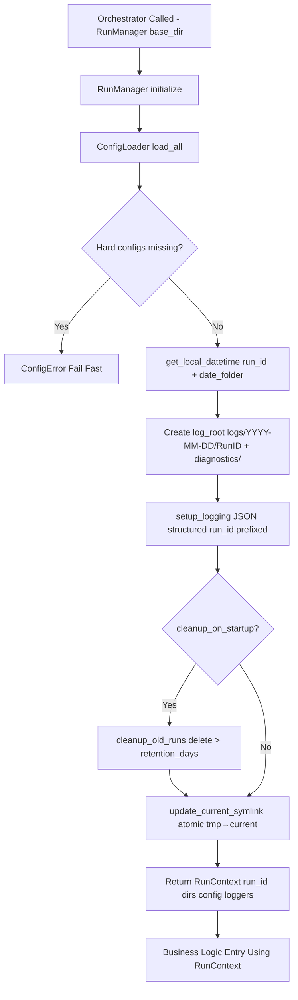

# TVHeadend M3U Processor - Implementation Status

Purpose: Living document to track the progress of implementing this project. Each section is to reflect the current status of the project  
Guidelines:

- File Hierarchy to be updated with the status of each directory/module
- Mermaid Graph tracks the business logic workflow that has been coded to this point
- Pseudo code snippets are to represent each function with a summary of actions. Do not provide actual code
- Implementation Table follows progress of implementation, adding more context to the phases
- Todo list is to track what has yet to be done


**Status:** Active | **Last Updated:** 2026-02-06 | **Progress:** 6/7 core modules
Phase 1: Core [6/7] - sports_lookups.py


📋 File Hierarchy (Live)

```text
opt/m3uapp/
├── config/
│ ├── main/
│ │ ├── paths.json [HARD]
│ │ └── settings.json [HARD]
│ ├── m3u/
│ │ ├── m3u_sources.csv [HARD]
│ │ ├── xml_sources.csv [HARD]
│ │ ├── tvg_name_list.csv [SOFT]
│ │ ├── channel_list.csv [SOFT]
│ │ ├── exclude_channels.txt [SOFT]
│ │ ├── exclude_groups.txt [SOFT]
│ │ ├── exclude_patterns.txt [SOFT]
│ │ └── parse_exclusions.txt [SOFT]
│ ├── sports/
│ │ ├── sports_config.json [HARD]
│ │ └── api_key.txt [HARD]
│ └── epg/
│ └── category_map.json [SOFT]
├── src/
│ └── core/
│ ├── entities.py [✅ COMPLETE]
│ ├── logger.py [✅ COMPLETE]
│ ├── config_loader.py [✅ COMPLETE]
│ ├── runmanager.py [✅ COMPLETE]
│ ├── diagnostic_collector.py [✅ COMPLETE]
│ ├── lineup_manager.py [✅ COMPLETE]
│ └── sports_lookups.py [PENDING]
│ ├── m3u/ [PHASE 2]
│ └── epg/ [PHASE 3]
├── logs/ [RUNTIME]
├── tvheadend/web/ [OUTPUT]
└── cron.sh [PHASE 4]
```

🔄 Workflow Business Logic
Only includes processes that are complete in the code base.



🛠️ Pseudocode Pipeline
Paraphrased code for context

`src/core/runmanager.py`

```python
from .config_loader import ConfigLoader
from .logger import setup_logging, get_local_datetime, LOCAL_FORMAT, DATE_FOLDER_FORMAT
from dataclasses import dataclass
from typing import Dict
import os, shutil

@dataclass
class RunContext:
    run_id: str; date_folder: str; log_dir: str; diagnostics_dir: str
    config_loader: ConfigLoader; loggers: Dict[str, object]

class RunManager:
    def __init__(self, base_dir: str):
        self.base_dir = base_dir
        self.config_loader = ConfigLoader(base_dir)
        self.context = None
    
    def initialize(self) -> RunContext:
        self.config_loader.load_all()
        config = self.config_loader
        run_dt = get_local_datetime(config.settings.timezone)
        run_id, date_folder = run_dt.strftime(LOCAL_FORMAT), run_dt.strftime(DATE_FOLDER_FORMAT)
        run_root = f"{config.paths.log_dir}/{date_folder}/{run_id}"
        diagnostics_dir = f"{run_root}/diagnostics"; os.makedirs(diagnostics_dir, exist_ok=True)
        loggers = setup_logging(run_root, run_id, config.settings.timezone, config.settings.log_level)
        if config.settings.cleanup_on_startup: self._cleanup_old(config.paths.log_dir, config.settings.log_retention_days, loggers["main"])
        self._update_symlink(config.paths.log_dir, run_root, loggers["main"])
        self.context = RunContext(run_id, date_folder, run_root, diagnostics_dir, config, loggers)
        return self.context
    
    def _cleanup_old(self, logdir: str, days: int, logger): 
        cutoff = get_local_datetime().date() - timedelta(days=days)
        for date_folder in os.listdir(logdir):
            date_path = f"{logdir}/{date_folder}"
            if os.path.isdir(date_path) and datetime.strptime(date_folder, DATE_FOLDER_FORMAT).date() < cutoff:
                shutil.rmtree(date_path); logger.info("Cleanup", extra={"folder": date_path})
    
    def _update_symlink(self, logdir: str, target: str, logger):
        current, tmp = f"{logdir}/current", f"{logdir}/current.tmp"
        os.symlink(target, tmp); os.replace(tmp, current); logger.info("Symlink OK", extra={"target": target})

```

`src/core/logger.py`
```python
import json, logging, os, zoneinfo
from datetime import datetime
from logging.handlers import RotatingFileHandler
from typing import Dict, Any

UTC_FORMAT, LOCAL_FORMAT, DATE_FOLDER_FORMAT = "%Y-%m-%dT%H:%M:%SZ", "%Y-%m-%d_%H-%M-%S", "%Y-%m-%d"

def get_local_datetime(tz: str) -> datetime: return datetime.now(zoneinfo.ZoneInfo(tz))

class JsonFormatter(logging.Formatter):
    def __init__(self, tz: str): self.tz = zoneinfo.ZoneInfo(tz)
    def format(self, rec: logging.LogRecord) -> str:
        local = datetime.fromtimestamp(rec.created, self.tz)
        payload = {"timestamp": local.strftime(UTC_FORMAT), "level": rec.levelname, "module": rec.name, "message": rec.getMessage(), **{k:v for k,v in rec.__dict__.items() if k not in logging.STD_KEYS}}
        return json.dumps(payload, separators=(",", ":"))

def make_handler(logfile: str, tz: str, max_bytes=10e6, backups=5) -> RotatingFileHandler:
    h = RotatingFileHandler(logfile, maxBytes=max_bytes, backupCount=backups, encoding="utf-8")
    h.setFormatter(JsonFormatter(tz)); h.setLevel(logging.DEBUG); return h

def setup_logging(log_dir: str, run_id: str, tz: str="UTC", level="DEBUG") -> Dict[str, logging.Logger]:
    os.makedirs(log_dir, exist_ok=True)
    lvl = getattr(logging, level.upper())
    logging.basicConfig(level=logging.WARNING)
    def build(name: str, suffix: str) -> logging.Logger:
        lg = logging.getLogger(name); lg.setLevel(lvl); lg.propagate = False; lg.handlers.clear()
        lg.addHandler(make_handler(os.path.join(log_dir, f"{run_id}_{suffix}.log"), tz)); return lg
    return {k: build(k, k) for k in ("main", "processor", "sports_api", "xml_filter")}

def get_logger(name: str) -> logging.Logger: return logging.getLogger(name)


```

`src/core/config_loader.py`
```python
from pathlib import Path
from typing import Dict, List, Any
from dataclasses import dataclass
import json, csv, os

@dataclass
class ConfigPaths: nginx_dir: str; tvh_xml_dir: str; log_dir: str; diagnostics_dir: str
@dataclass
class ConfigSettings: network_timeout: int; max_retries: int; retry_delay: int; log_retention_days: int; log_level: str; enable_compression: bool; cleanup_on_startup: bool; timezone: str

class ConfigError(Exception): pass

class ConfigLoader:
    def __init__(self, base_dir: str):
        self.base_dir = Path(base_dir)
        self.config_dir = self.base_dir / "config"
        self.main_dir = self.config_dir / "main"
        self.m3u_dir = self.config_dir / "m3u"
        self.sports_dir = self.config_dir / "sports"
        self.epg_dir = self.config_dir / "epg"
        # state: paths, settings, m3u_sources:List[Dict], xml_sources:List[Dict], maps:Dicts, lists:List[str], api_key:str
        
    def load_all(self):
        configs = [
            (self.main_dir/"paths.json", self._template_paths, self._load_paths, True),
            (self.main_dir/"settings.json", self._template_settings, self._load_settings, True),
            (self.m3u_dir/"m3u_sources.csv", self._template_csv, self._load_csv_lists, True),
            (self.m3u_dir/"xml_sources.csv", self._template_csv, self._load_csv_lists, True),
            (self.sports_dir/"sports_config.json", self._template_sports_config, self._load_json_dict, True),
            (self.sports_dir/"api_key.txt", self._template_api_key, self._load_str, True),
            (self.m3u_dir/"tvg_name_list.csv", self._template_csv_names, lambda: self._load_name_map(self.tvg_name_map), False),
            (self.m3u_dir/"channel_list.csv", self._template_csv_names, lambda: self._load_name_map(self.channel_map), False),
            (self.epg_dir/"category_map.json", self._template_category_map, self._load_json_dict, False),
        ]
        txt_lists = ["exclude_channels", "exclude_groups", "exclude_patterns", "parse_exclusions"]
        
        for attr, path in [(attr, self.m3u_dir/f"{attr}.txt") for attr in txt_lists]:
            configs.append((path, self._template_empty_txt, lambda a=attr,p=path: self._load_txt_list(a,p), False))
            
        pending_hard = set()
        for path, template, loader, is_hard in configs:
            path.parent.mkdir(parents=True, exist_ok=True)
            if not path.exists(): template(path); pending_hard.add(str(path)) if is_hard else None
            loader()
        if pending_hard: raise ConfigError(f"Missing hard configs: {pending_hard}")
    
    def _load_csv_lists(self): self.m3u_sources, self.xml_sources = list(csv.DictReader(open(self.m3u_dir/"m3u_sources.csv"))), list(csv.DictReader(open(self.m3u_dir/"xml_sources.csv")))
    def _load_name_map(self, target: Dict): for row in csv.DictReader(open(self.m3u_dir/"tvg_name_list.csv")): target[row["search_str"]] = (row["new_display_name"], row["ch_no"])
    def _load_txt_list(self, attr: str, path: Path): setattr(self, attr, [l.strip() for l in open(path) if l.strip()])
    def _load_json_dict(self): self.sports_config = json.load(open(self.sports_dir/"sports_config.json"))
    
    def _template_paths(self, p): self._write(p, {"nginx_dir":"/opt/m3uapp/tvheadend/web", "tvh_xml_dir":"/opt/appdata/tvheadend/data", "log_dir":"/opt/m3uapp/logs", "diagnostics_dir":"/opt/m3uapp/logs/diagnostics"})
    def _template_csv(self, p): self._write(p, "url,output_name,description\n")
    def _write(self, p: Path, data): with open(p.with_suffix('.tmp'), 'w') as f: json.dump(data, f, indent=2) if isinstance(data,dict) else f.write(data); os.rename(p.with_suffix('.tmp'), p)
```

`/src/core/diagnostic_collector.py`
```python
from dataclasses import dataclass, field
from pathlib import Path
from typing import List, Dict

@dataclass
class DiagnosticCollector:
    base_dir: Path
    run_id: str
    unmapped_games: List[Dict] = field(default_factory=list)
    missing_teams: List[Dict] = field(default_factory=list)
    unmapped_categories: Dict[str, int] = field(default_factory=dict)

    def record_failure(self, kind: str, payload: Dict): ...
    def increment_category(self, name: str): ...
    def dump_all(self): ...
```

`/src/core/lineup_manager.py`
```python
from dataclasses import dataclass

@dataclass
class Lineup:
    id: int
    teams: set[str]
    games: list[str]


class SportsLineupManager:
    def __init__(self, league_key, service_prefix):
        self.league = league_key
        self.prefix = service_prefix
        self.lineups = []

    def assign_lineup(self, game):
        teams = sorted([game.team1_canonical, game.team2_canonical])
        if existing := self._find_lineup_with_unique_teams(teams):
            return self._assign_to_existing(existing, teams)
        return self._create_new_lineup(teams)

    def _find_lineup_with_unique_teams(self, teams): pass
    def _assign_to_existing(self, lineup, teams): pass
    def _create_new_lineup(self, teams): pass

    def get_lineup_summary(self): pass
```

`/src/core/sports_lookups.py`
```python
from typing import Dict, Optional
from .entities import TeamInfo, LeagueConfig, SportsLookups

# Immutable lookup schema (config → fast O(1) maps)
def build_sports_lookups(cfg: Dict) -> SportsLookups:
    leagues, hints, teams = {}, {}, {}
    for league, data in cfg.items():
        lcfg = LeagueConfig(...)
        leagues[league] = lcfg
        for canon, syns in data["teams"].items():
            info = TeamInfo(canon, league, syns)
            for name in [canon, *syns]: teams[name.lower()] = info
        for hint in data["hints"]: hints[hint.lower()] = league
    return SportsLookups(leagues=leagues, allhints=hints, teamindex=teams)

# Team resolution (input name → TeamInfo)
def find_synonym_in_dict(name: str, index: Dict[str, TeamInfo]) -> Optional[TeamInfo]:
    if name.lower() in index: return index[name.lower()]
    for info in index.values():
        if name.lower() in map(str.lower, info.synonyms): return info
    return None
```

📊 Implementation Status

| Phase              | Module          | Status     | Notes                                    |
|--------------------|-----------------|------------|------------------------------------------|
| Phase 1: Core      | configloader.py | Completed | loads and fails as designed.         |
|                    | logger.py       | Completed | outputs logs in the desired format   |
|                    | runmanager.py   | Completed | Creates log structure with local timezones |
|                    | diagnostic_collector.py | Completed | Creates individual diagnostic logs |
|                    | lineup_manager.py | Completed | Creates and manages the lineups for channel assignments |
|                    | entities.py     | Completed | 7 dataclasses |
|                    | sports_lookups.py | Completed | Creates a sports lookup dictionary using the 3 entities |
| Phase 2: M3U       | parser.py        | Pending | |

🎯 Next Single Step
src/m3u/parser.py - Parse m3u records in to ChannelRecord:

1. ChannelRecord - Per M3U, mutable, cleared after each provider
2. GameRecord - Global, persists til sports.xml
3. EndpointRecord - API grouping
4. APIRecord - Raw API response
5. TeamInfo(frozen) - Canonical team lookup
6. LeagueConfig(frozen) - League settings
7. SportsLookups(frozen) - Master lookup index
8. ConfigPaths, ConfigSettings - From configloader draft
