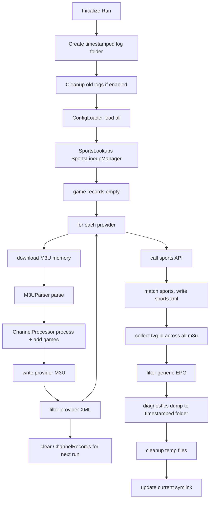

TVHeadend M3U Processor - Complete Project Outline
🎯 Project Goal
Cron job (every 8h) downloads IPTV M3U sources → processes → outputs:
States reset on every run

- `provider.m3u` files (nginx-served for TVHeadend networks)
- `provider.xml` files (provider-specific XMLTV filtered by tvg-ids category-remapped, generic title renames)
- `sports.xml` (global sports lineup aggregation)
- `generic_epgs.xml` (filtered + category-remapped + generic title renames)

Environment: Stdlib Python 3 in Alpine LXC (NO external deps)

📁 Directory Structure

```text
/opt/m3u_app/
├── config/
│   ├── m3u/
│   │   ├── m3u_sources.csv
│   │   ├── xml_sources.csv
│   │   ├── tvg_name_list.csv
│   │   ├── channel_list.csv
│   │   ├── exclude_channels.txt
│   │   ├── exclude_groups.txt
│   │   ├── exclude_patterns.txt
│   │   └── parse_exclusions.txt
│   ├── sports/
│   │   ├── sports_config.json
│   │   └── api_key.txt
│   ├── epg/
│   │   └── category_map.json
│   ├── main/
│   │   └── paths.json
│   │   └── settings.json
├── src/
│   ├── core/
│   │   ├── entities.py
│   │   ├── config_loader.py
│   │   ├── logger.py
│   │   ├── diagnostic_collector.py
│   │   ├── lineup_manager.py
│   │   └── sports_lookups.py
│   ├── m3u/
│   │   ├── parser.py
│   │   ├── processor.py
│   │   └── writer.py
│   ├── epg/
│   │   ├── xml_processor.py
│   │   ├── api_client.py
│   │   └── generic_epg.py
│   └── orchestrator.py
├── logs/
│   ├── processor.log
│   └── diagnostics/
│       ├── unmapped_games.json
│       ├── missing_teams.json
│       ├── unmapped_categories.json
│       └── lineup_summary.json
├── tvheadend/
│   └── web/
|       └── *.m3u
└── cron.sh
```

⚙️ Configuration Files (12 Total)

- `config/m3u/m3u_sources.csv`

```text
url,output_name,description
http://drewlive2423.duckdns.org:8081/DrewLive/Pixelsports.m3u8,DrewLivePixelSports,DrewLive Pixel Sports
```

- `config/m3u/xml_sources.csv`

```text
url,output_name,description
http://drewlive2423.duckdns.org:8081/DrewLive/DrewLive.xml.gz,DrewLive,DrewLive
```

- `config/m3u/tvg_name_list.csv (Priority 1)`

```text
search_str,new_display_name,ch_no
102 ABC News Live,ABC NEWS LIVE,1
```

- `config/m3u/channel_list.csv (Priority 2)`

```text
search_str,new_display_name,ch_no
ESPN.1,ESPN,101
```

- `config/m3u/exclude_*.txt`

```text
# exclude_channels.txt
80s Rewind

# exclude_groups.txt
Roxiestreams - Fighting

# exclude_patterns.txt
*720p*
*TEST*
```

- `config/m3u/parse_exclusions.txt`

```text
48 Hours
```

- `config/sports/sports_config.json`

```json
{
    "NFL": {
        "service_prefix": "NFL", //Canonical League Name
        "game_duration": {"hours": 4, "minutes": 0},
        "hints": ["NFL", "FOOTBALL"], //Matching Hints for M3U Entry, ignore case
        "api_sports": {
          "enabled": true,
          "endpoint": "american-football",
          "league_name": "NFL" //API League Identifier
        },
        "teams": {
          "Pittsburgh Steelers": ["Steelers", "Pittsburgh"], //"Canonical Name": ["Synonyms"] #Priority on Canonical Name matching, fall back to synonyms
          "Buffalo Bills": ["Bills", "Buffalo"]
        }
      }
    }
}
```

- `config/main/paths.json`

```json
{
  "nginx_dir": "opt/m3u_app/tvheadend/web",
  "tvh_xml_dir": "/opt/appdata/tvheadend/data", 
  "log_dir": "/opt/m3u_app/logs",
  "diagnostics_dir": "/opt/m3u_app/logs/diagnostics"
}
```

- `config/main/settings.json`

```json
{
  "network_timeout": 30,
  "max_retries": 3,
  "retry_delay": 10,
  "log_retention_days": 14,
  "log_level": "DEBUG",
  "enable_compression": true,
  "cleanup_on_startup": true
}
```

- `config/epg/category_map.json`

```json
{
  "3x3 basketball": "Team sports",
  "Academic": "Education",
  "Action Sports": "Sports",
  "Action sports": "Sports",
  "Action": "Adventure"
}
```

Create all config files based on templates if not found.
Templates are shown in examples above.

- Exclusions in `*.txt` are lists and will be created empty
- Config files in `*.csv` are to be created with headers only

Only exit if Hard Fail config files not found. 
- If any Hard Fail config is missing or malformed (invalid JSON/CSV format) during check of all config files, log critical error, create file from template with context, continue with config loading but do not start m3u processing, exit the run.
- No fallback values - system cannot function without these.

```text
config/main/paths.json
config/main/settings.json
config/m3u/m3u_sources.csv  
config/m3u/xml_sources.csv
config/sports/sports_config.json
config/sports/api_key.txt
```

Soft Fail if these not found
Create and then continue

```text
config/m3u/tvg_name_list.csv
config/m3u/channel_list.csv
config/m3u/exclude_channels.txt
config/m3u/exclude_groups.txt
config/m3u/exclude_patterns.txt
config/m3u/parse_exclusions.txt
config/epg/category_map.json
```

Network Operations:

- Download timeouts: Use settings.json → network_timeout (seconds)
- Retry logic: Attempt max_retries with retry_delay seconds between attempts
- Exponential backoff not required for simplicity
- If all retries fail for a provider, log error and skip that provider (continue with others)

🏗️ Core Entities (dataclasses)

```python
#Defined at the beginning. 
#Per m3u writing. Can be purged and re-used per m3u
@dataclass 
class ChannelRecord:
    raw_tags: List[Dict[str,str]]      # All EXT* verbatim
    attributes: Dict[str,str]          # tvg-id, tvg-name, tvg-chno (MUTABLE)
    display_name: str                  # Post-comma service name (mutated)
    urls: List[str]                    # All stream URLs

#Defined at the beginning and persists until sports.xml is written
#No exact duplicate entries

GameRecord Uniqueness Key
matchup_key = f"{min(team1_canonical, team2_canonical)} {max(team1_canonical, team2_canonical)}"
# e.g. "Buffalo Bills Pittsburgh Steelers" (alphabetically sorted)

@dataclass 
class GameRecord:
    league: str                      # "NFL"
    service_prefix: str              # "NFL" (from LeagueConfig)
    matchup_key: str                 # "Buffalo Bills Pittsburgh Steelers" 
    team1_canonical: str             # Alphabetical team 1 (pre-API)
    team2_canonical: str             # Alphabetical team 2 (pre-API)  
    lineup_id: int                   # 1, 2, 3 (lineup index)
    channel_assignment: int          # 1, 2, 3 (position in lineup)
    api_endpoint: str                # “American-football” (Quick unique endpoint filter)
    api_time: Optional[datetime]     # From API (updates team1@team2 order)
    game_duration: Dict[str,int]     # From @dataclass

@dataclass
class EndpointRecord:
    endpoint: str                    # "american-football"
    games: Dict[str, GameRecord]     # matchup_key → GameRecord

#Called at the end of M3U processing.
#Used to store API data for sport.xml
@dataclass
class APIRecord:
    endpoint: str                       # "basketball"
    league_name: str                    # "NBA"  
    api_key: str                        # From config/sports/api_key.txt
    games: List[Dict]                   # Raw API response
    lookup_league: Optional[str]        # "NBA" - SportsLookups key to validate

#Used as a source of truth for team matching and Canonical name
#Used by both GameRecord and APIRecord to populate team data and facilitate matches
@dataclass(frozen=True)
class TeamInfo:
    canonical: str              # "Pittsburgh Steelers"
    league: str                 # "NFL" 
    synonyms: List[str]         # ["Steelers", "Pittsburgh"]

@dataclass(frozen=True)
class LeagueConfig:
    service_prefix: str         # "NFL"
    hints: List[str]            # ["NFL", "FOOTBALL"] 
    api_sports: Optional[Dict]  # {"enabled": true, "endpoint": "american-football", "league_name": "NFL"}
    game_duration: Dict[str,int] # {"hours": 4, "minutes": 0}
    teams: Dict[str, TeamInfo]  # canonical → TeamInfo

@dataclass(frozen=True) 
class SportsLookups:
    leagues: Dict[str, LeagueConfig]      # "NFL" → LeagueConfig
    all_hints: Dict[str, str]             # "nfl" → "NFL", "nhl" → "NHL"
    team_index: Dict[str, TeamInfo]       # ALL teams flattened: "steelers" → TeamInfo(canonical="Pittsburgh Steelers", league="NFL")
```

🔧 Class Architecture (SRP)

| Module | Class                        | Responsibility                                                    | Key Methods                         |
|--------|------------------------------|-------------------------------------------------------------------|-------------------------------------|
| core/  | ConfigLoader                 | Load 7 configs → memory                                           | load_all()                          |
|        | Logger                       | JSON structured logging                                           | setup_logging()                     |
|        | DiagnosticCollector          | Unmapped games/categories                                         | add_unmapped_game()                 |
|        | SportsLineupManager          | Sequential team→lineup                                            | assign_lineup()                     |
|        | SportsLookups / LeagueConfig | Team/hint lookups                                                 | match_hint()                        |
| m3u/   | M3UParser                    | Raw M3U → ChannelRecords                                          | parse_m3u()                         |
|        | ChannelProcessor             | 6-step processing (ChannelRecords, GameRecord)                    | process_channel()                   |
|        | M3UWriter                    | ChannelRecords → M3U                                              | write_provider_m3u()                |
| epg/   | XMLTVFilter                  | Filter XML by tvg-ids                                             | filter_by_tvgids()                  |
|        | SportsAPI                    | API fetch → APIRecord                                             | fetch_games()                       |
|        | SportsXML                    | match + write sports.xml<br />APIRecord → GameRecord → sports.xml | match_games()<br />write_sports_xml |
|        | GenericEPG                   | Filter + category map                                             | filter_generic()                    |
| \-      | PipelineOrchestrator         | Cron pipeline                                                     | run()                               |

🔄 Pipeline Flow



Memory Management:

- ChannelRecord instances are created fresh for each provider
- No objects persisted between provider processing
- After each provider's M3U is written, clear all associated ChannelRecords from memory

Memory Isolation: Each provider's processing runs in isolation. ChannelRecords are cleared after each provider's M3U is written. Global state (GameRecords, EndpointRecords) persists for sports.xml generation but is cleared between full cron runs.

Run Initialization Code:

```python
class RunManager:
    def __init__(self):
        self.run_id = datetime.utcnow().strftime("%Y-%m-%d_%H-%M-%S")
        self.date_folder = datetime.utcnow().strftime("%Y-%m-%d")
        self.setup_directories()
        
    def setup_directories(self):
        # Create log structure
        self.log_dir = f"{config.paths.log_base_dir}/{self.date_folder}/{self.run_id}"
        os.makedirs(f"{self.log_dir}/diagnostics", exist_ok=True)
        
        # Setup logging to timestamped file
        logger.setup(self.log_dir, self.run_id)
        
    def cleanup_old_runs(self):
        if config.settings.cleanup_on_startup:
            # Remove folders older than retention days
            # ...
```

⚙️ process_channel() - 6 Explicit Steps

```python
def process_channel(record: ChannelRecord, current_provider: str) -> Optional[ChannelRecord]:
    logger.debug("process_channel:start", extra={
        "provider": provider,
        "display_name": record.display_name,
        "tvg_id": record.attributes.get("tvg-id")
    })

    # ===== 1. RENAME =====
    record = rename_lookup(record)

    # ===== 2. CLEANUP (PROTECTED BY PARSE EXCLUSIONS) =====
    # Some channels intentionally start with numbers or formats
    # that cleanup would destroy. Exact matching only
    if record.display_name not in config.parse_exclusions:
        record = cleanup_record(record)

    # ===== 3. EXCLUDE =====
    if should_exclude(record):
        logger.info("channel_excluded", extra={
            "provider": provider,
            "display_name": record.display_name,
            "group": record.attributes.get("group-title"),
            "reason": record.attributes.get("_exclude_reason")
        })
        return None

    logger.debug("process_channel:pass", extra={
        "provider": provider,
        "final_display_name": record.display_name,
        "tvg_id": record.attributes.get("tvg-id")
    })
    
    # ===== SPORTS WORKFLOW =====
    game = detect_sports(record)
    if not game:
        return record
    
    # Single decision point
    if has_existing_gamerecord(game.matchup_key, endpoint_records):
        apply_gamerecord_attributes(record, get_existing_gamerecord(game.matchup_key))
    else:
        create_new_gamerecord(game, record, current_provider)
    
    return record

```

Rename Lookup

```python
def rename_lookup(record: ChannelRecord) -> ChannelRecord:
    original_name = record.display_name

    # Priority 1: tvg-name based rename
    tvg_name = record.attributes.get("tvg-name")
    if tvg_name and tvg_name in config.tvg_name_map:
        new_name, ch_no = config.tvg_name_map[tvg_name]
        record.display_name = new_name
        record.attributes["tvg-name"] = new_name
        if ch_no:
            record.attributes["tvg-chno"] = ch_no

        logger.debug("rename:tvg_name", extra={
            "from": original_name,
            "to": new_name
        })
        return record

    # Priority 2: display-name based rename
    if original_name in config.channel_name_map:
        new_name, ch_no = config.channel_name_map[original_name]
        record.display_name = new_name
        record.attributes["tvg-name"] = new_name
        if ch_no:
            record.attributes["tvg-chno"] = ch_no

        logger.debug("rename:display_name", extra={
            "from": original_name,
            "to": new_name
        })
        return record

    logger.debug("rename:noop", extra={"display_name": original})
    return record

```

Cleanup Record

```python
def cleanup_record(record: ChannelRecord) -> ChannelRecord:
    original_name = record.display_name

    # ===== SAFE NORMALIZATION =====
    name = original_name
    name = re.sub(r'\s+', ' ', name).strip()
    name = re.sub(r'\s*\(Source.*?\)$', '', name, flags=re.IGNORECASE)
    name = re.sub(r'^\d+\s+', '', name)
    name = name.replace(' HD', '').replace(' FHD', '')

    record.display_name = name

    return record
```

Should Exclude

```python
def should_exclude(record: ChannelRecord) -> bool:
    name = record.display_name
    group = record.attributes.get("group-title", "")

    if name in config.exclude_channels:
        record.attributes["_exclude_reason"] = "exclude_channels"
        return True

    if group in config.exclude_groups:
        record.attributes["_exclude_reason"] = "exclude_groups"
        return True

    for pattern in config.exclude_patterns:
        if fnmatch.fnmatch(name, pattern):
            record.attributes["_exclude_reason"] = f"exclude_pattern:{pattern}"
            return True

    return False

```

CSV Matching Strictness

- All CSV lookups (tvg_name_list.csv, channel_list.csv) are case-sensitive exact matches after whitespace normalization, no fuzzy matching.

Duplicate tvg-id Across Providers

- Same tvg-id across providers is allowed and intentional
- TVHeadend fallback behavior is relied upon
- No attempt to namespace by provider

Sports Detection

```python
def detect_sports(record: ChannelRecord, lookups: SportsLookups) -> Optional[GameRecord]:
    # 1. League hint (priority sources)
    sources = [record.attributes.get('group-title'), record.attributes.get('tvg-id'), 
               record.attributes.get('tvg-name'), record.display_name]
    league_key = next((lookups.all_hints.get(s.lower()) for s in sources if s), None)
    
    # 2. Extract teams
    match = re.search(r'([A-Za-z\s]+?)(?:\s+(?:vs|VS|Vs|@|At|AT|at)\s+)([A-Za-z\s]+?)(?=\s|$)', 
                      record.display_name, re.IGNORECASE)
    if not match:
        return None
    team1_raw, team2_raw = match.group(1).strip().lower(), match.group(3).strip().lower()
    
    # 3. PRIORITY LOOKUP: league-specific → global
    team1_info = None
    team2_info = None
    
    # Fuzzy synonym matching is simple “in” comparison.
    # Diagnostic reports will inform when to update synonyms for proper matching. 
    if league_key and league_key in lookups.leagues:
        # FAST: League-specific teams first
        league_teams = lookups.leagues[league_key].teams
        team1_info = (league_teams.get(team1_raw) or 
                     find_synonym_in_dict(team1_raw, league_teams) or None)
        team2_info = (league_teams.get(team2_raw) or 
                     find_synonym_in_dict(team2_raw, league_teams) or None)
    
    # FALLBACK: Global team_index
    if not team1_info:
        team1_info = (lookups.team_index.get(team1_raw) or 
                     find_synonym_in_dict(team1_raw, lookups.team_index) or None)
    if not team2_info:
        team2_info = (lookups.team_index.get(team2_raw) or 
                     find_synonym_in_dict(team2_raw, lookups.team_index) or None)
    
    # 4. Cross-league validation (iterative)
    if team1_info and team2_info and team1_info.league != team2_info.league:
        # Try team2 in team1's league, team1 in team2's league
        alt_league = team1_info.league
        alt_teams = lookups.leagues[alt_league].teams
        team2_alt = find_synonym_in_dict(team2_raw, alt_teams)
        if team2_alt:
            team2_info = team2_alt
        else:
            alt_league = team2_info.league
            alt_teams = lookups.leagues[alt_league].teams  
            team1_alt = find_synonym_in_dict(team1_raw, alt_teams)
            if team1_alt:
                team1_info = team1_alt
    
    if not (team1_info and team2_info):
        diagnostics.add_unmapped_game(league_key, team1_raw, team2_raw, "No team match")
        return None
    
    # 5. Create GameRecord
    matchup_key = f"{min(team1_info.canonical, team2_info.canonical)} {max(team1_info.canonical, team2_info.canonical)}"
    return GameRecord(
        league=team1_info.league,
        service_prefix=lookups.leagues[team1_info.league].service_prefix,
        matchup_key=matchup_key,
        team1_canonical=team1_info.canonical,
        team2_canonical=team2_info.canonical,
        # ... rest
    )
```

```python
def apply_gamerecord_attributes(record: ChannelRecord, game: GameRecord) -> None:
    """Single responsibility: Mutate record attributes from GameRecord."""
    record.attributes["tvg-id"] = f"{game.service_prefix}.{game.channel_assignment}"
    record.attributes["tvg-name"] = f"{game.service_prefix} {game.channel_assignment}"
    record.display_name = record.attributes["tvg-name"]
    logger.debug("Applied existing GameRecord attributes", extra={"matchup_key": game.matchup_key})

def create_new_gamerecord(game: GameRecord, record: ChannelRecord, current_provider: str) -> None:
    """Single responsibility: Create + store new GameRecord + assign lineup."""
    # Lineup assignment
    league_manager = managers.setdefault(game.league, SportsLineupManager(game.league))
    service_prefix, channel_assignment, lineup_id = league_manager.assign_lineup(game)
    
    # Populate GameRecord
    game.lineup_id = lineup_id
    game.channel_assignment = channel_assignment
    game.service_prefix = service_prefix
    game.api_endpoint = league_manager.league_config.api_sports.endpoint
    
    # Store globally (first provider wins)
    endpoint_record = endpoint_records.setdefault(game.api_endpoint, EndpointRecord(endpoint=game.api_endpoint, games={}))
    endpoint_record.games[game.matchup_key] = game
    
    # Apply attributes
    apply_gamerecord_attributes(record, game)
    
    logger.info("Created new GameRecord", extra={
        "matchup_key": game.matchup_key, "tvg_id": record.attributes["tvg-id"]
    })

def has_existing_gamerecord(matchup_key: str, endpoint_records: Dict[str, EndpointRecord]) -> bool:
    """O(1) existence check across all endpoints."""
    return any(matchup_key in er.games for er in endpoint_records.values())

def get_existing_gamerecord(matchup_key: str, endpoint_records: Dict[str, EndpointRecord]) -> GameRecord:
    """Return first matching GameRecord."""
    for er in endpoint_records.values():
        if matchup_key in er.games:
            return er.games[matchup_key]
    raise ValueError("GameRecord not found - call has_existing_gamerecord first")

```

🪣 SportsLineupManager Algorithm (VALIDATED) Fills lineups sequentially with unique teams (no team duplication within lineup).

Core Logic:

```python
class SportsLineupManager:
    def __init__(self, league_key: str):
        self.league = league_key
        self.service_prefix = lookups.leagues[league_key].service_prefix  # e.g. "NFL"
        self.lineups = []  # List[Lineup]
        # Lineup: {'id': int, 'teams': set[str], 'games': dict[str→int]}

    def assign_lineup(self, game: GameRecord) -> Tuple[str, int, int]:
        team1, team2 = sorted([game.team1_canonical, game.team2_canonical])

        matchup_str = f"{team1} vs {team2}"

        
        # Sequential lineup scan (1→N)
        for lineup in self.lineups:
            # ONLY check team uniqueness - no matchup lookup needed
            if team1 not in lineup['teams'] and team2 not in lineup['teams']:
                lineup['games'].append(matchup_str)
                lineup['teams'].add(team1)
                lineup['teams'].add(team2)
                return self.service_prefix, len(lineup['games']), lineup['id']
        
        # New lineup
        new_id = len(self.lineups) + 1
        self.lineups.append({
            'id': new_id, 
            'teams': {team1, team2}, 
            'games': [matchup_str]
        })
        return self.service_prefix, 1, new_id

```

```python
lineup1 = {
    'id': 1,
    'teams': {'Denver', 'Detroit', 'Utah', 'Indiana', 'NY', 'Washington'},
    'games': [
        'Denver vs Detroit',      # channel 1
        'Utah vs Indiana',        # channel 2  
        'NY vs Washington'        # channel 3
    ]
}
```

```text
Fill a lineup with a unique set of TEAMS, not matchups. 
Repeats of either team create a new lineup (or move to the next in the iteration loop).
We have to do it sequentially because that is how the m3u workflow proceeds, but the concept is like sorting duplicates. 
You cannot have a duplicate of a team in a lineup. 
Once the lineup is full, you assign the matchups a sequential channel identifier(tvg-id), NFL.1, NFL.2. 
Each lineup has it's own NFL.1, etc.
Duplicates of a matchup with different url's are assigned the same channel to use as fallback
Example: Patriots Vs Steelers
Provider 1: #EXTINF:-1 tvg-id="NFL.1" tvg-name="NFL 1",NFL 1
http://game1.com/hd
Provider 1: #EXTINF:-1 tvg-id="NFL.1" tvg-name="NFL 1",NFL 1
http://game1.com/sd
Provider 2: #EXTINF:-1 tvg-id="NFL.1" tvg-name="NFL 1",NFL 1
http://randomgame.com/patriotsvssteelers
```

```text
Example
Matchups are rarely present for more than 72 hours from providers.
=== FEBRUARY 3 ===
Denver @ Detroit: NBA.1 <- lineup one: Unique Teams
Utah @ Indiana: NBA.2 <- lineup one: Unique Teams
New York @ Washington: NBA.3 <- lineup one: Unique Teams
LA @ Brooklyn: NBA.4 <- lineup one: Unique Teams
Atlanta @ Miami: NBA.5 <- lineup one: Unique Teams
Boston @ Dallas: NBA.6 <- lineup one: Unique Teams
Chicago @ Milwaukee: NBA.7 <- lineup one: Unique Teams
Orlando @ OKC: NBA.8 <- lineup one: Unique Teams
Philadelphia @ Golden State: NBA.9 <- lineup one: Unique Teams
Phoenix @ Portland: NBA.10 <- lineup one: Unique Teams

=== FEBRUARY 5 ===
Miami @ Boston: NBA.1 <- lineup two: Boston and Miami repeat in lineup one
New York @ Detroit: NBA.2 <- lineup two: New York and Detroit repeat in lineup one
Indiana @ Milwaukee: NBA.3 <- lineup two: Indiana and Milwaukee repeat in lineup one
New Orleans @ Minnesota: NBA.11 <- lineup one because neither team exist there
Memphis @ Portland: NBA.4 <- lineup two: Portland repeat in lineup one
LA @ Sacramento: NBA.5 <- lineup two: LA repeat in lineup one

=== CHANNEL CONTENTS ===
NBA.1: boston celtics, denver nuggets, detroit pistons, miami heat → ['Denver @ Detroit', 'Miami @ Boston']
NBA.2: indiana pacers, new york knicks, utah jazz, washington wizards → ['Utah @ Indiana', 'New York @ Detroit']
NBA.3: chicago bulls, indiana pacers, milwaukee bucks → ['Chicago @ Milwaukee', 'Indiana @ Milwaukee']
NBA.4: brooklyn nets, la lakers, memphis grizzlies, portland trail blazers → ['LA @ Brooklyn', 'Memphis @ Portland']
NBA.5: atlanta hawks, la lakers, miami heat, sacramento kings → ['Atlanta @ Miami', 'LA @ Sacramento']
NBA.6: boston celtics, dallas mavericks → ['Boston @ Dallas']
NBA.7: chicago bulls, milwaukee bucks → ['Chicago @ Milwaukee']
NBA.8: oklahoma city thunder, orlando magic → ['Orlando @ OKC']
NBA.9: golden state warriors, philadelphia 76ers → ['Philadelphia @ Golden State']
NBA.10: phoenix suns, portland trail blazers → ['Phoenix @ Portland']
NBA.11: minnesota timberwolves, new orleans pelicans → ['New Orleans @ Minnesota']
```

Sports API: api-sports.io
All api responses follow the same format, regardless of endpoint
`https://v1.{api_endpoint}.api-sports.io/games`

Api is called by single date string only `date=2026-02-05`.
Only two calls per endpoint will be made. Today and Today+1

```json
{
    "get": "games",
    "parameters": {
        "date": "2022-09-30"
        },
    "errors": [ ],
    "results": 6,
    "response": [
        {
        "game": {
            "id": 4550,
            "stage": "FBS (Division I-A)",
            "week": "5",
            "date": {
            "timezone": "UTC",
            "date": "2022-09-30",
            "time": "00:00",
            "timestamp": 1664496000
            },
        "venue": {
            "name": null,
            "city": null
            },
        "status": {
            "short": "FT",
            "long": "Finished",
            "timer": null
            }
        },
    "league": {
        "id": 2,
        "name": "NCAA",
        "season": "2022",
        "logo": "https://media.api-sports.io/american-football/leagues/2.png",
        "country": {
            "name": "USA",
            "code": "US",
            "flag": "https://media.api-sports.io/flags/us.svg"
            }
        },
    "teams": {
        "home": {
            "id": 136,
            "name": "BYU",
            "logo": "https://media.api-sports.io/american-football/teams/136.png"
            },
        "away": {
            "id": 45,
            "name": "Utah State",
            "logo": "https://media.api-sports.io/american-football/teams/45.png"
            }
        },
    "scores": {
        "home": {
            "quarter_1": 14,
            "quarter_2": 3,
            "quarter_3": 14,
            "quarter_4": 7,
            "overtime": null,
            "total": 38
            },
        "away": {
            "quarter_1": 7,
            "quarter_2": 10,
            "quarter_3": 3,
            "quarter_4": 6,
            "overtime": null,
            "total": 26
            }
        }
    }
    ]
}
```

Parse API

```text
extract from response []
    game.date for use in GameRecord api_time
    game.league.name for matching against SportsLookups.league.api_league_name
    game.teams.home.name and match against SportsLookups.{league}.canoncal/synonyms. Return Canonical Name. Assign to "Home"
    game.teams.away.name and match against SportsLookups.{league}.canoncal/synonyms. Return Canonical Name. Assign to "Away"

Record all failures to match against SportsLookups for Leagues listed in sports_config. Add to missing_teams.json
```

Match API Games

```python
def match_api_to_games(api_record: APIRecord, game_records: List[GameRecord], lookups: SportsLookups) -> List[GameRecord]:
    
    # **LEAGUE-SCOPED lookup - O(1) vs O(N)**
    league_key = api_record.lookup_league  # "NBA" from SportsLookups
    if league_key not in lookups.leagues:
        logger.warning("API league not configured", extra={"league": api_record.league_name})
        return []
    
    league_teams = lookups.leagues[league_key].teams  # League-specific only
    
    for api_game in api_record.games:
        api_home_raw = api_game['teams']['home']['name'].strip().lower()
        api_away_raw = api_game['teams']['away']['name'].strip().lower()
        
        # **League-specific canonical lookup**
        api_home_canonical = (league_teams.get(api_home_raw) or 
                            find_synonym_in_dict(api_home_raw, league_teams))
        api_away_canonical = (league_teams.get(api_away_raw) or 
                            find_synonym_in_dict(api_away_raw, league_teams))
        
        if not (api_home_canonical and api_away_canonical):
            diagnostics.add_missing_team(api_record.league_name, 
                                       [api_home_raw, api_away_raw], "League teams missing")
            continue
            
        api_matchup_key = f"{min(api_home_canonical.canonical, api_away_canonical.canonical)} {max(api_home_canonical.canonical, api_away_canonical.canonical)}"
        
        # **League + matchup_key match**
        for game in game_records:
            if (game.matchup_key == api_matchup_key:
                game.api_time = parse_datetime(api_game['date'])
                game.team1_canonical = api_away_canonical.canonical  # Away
                game.team2_canonical = api_home_canonical.canonical  # Home
                break
        else:
            diagnostics.add_unmapped_game(api_record.league_name, api_home_raw, api_away_raw, "No M3U match")
    
    return updated_games
```

Creating sports.xml

```text
match alphabetical API matchups to GameRecord alphabetical Key
Update date and home/away assignments
Create channel and programme
Continue if GameRecords has no match to APIRecord. Log the reason for no match to unmapped_games.json
Continue if APIRecord has no match to GameRecord. Log the reason for no match to unmapped_games.json
```

API Partial Match Policy

- API game matches are best-effort based on leagues
- Missing API data never blocks sports.xml generation
- Games without API match still get channels but no programme entries

🕒 Timezone Policy (Explicit)
All times in UTC:

- System clock should be set to UTC
- No timezone conversions at any point
- API calls use UTC dates: date=YYYY-MM-DD
- XMLTV timestamps in UTC format: 20240203T180000Z
- Game durations added directly to UTC timestamps

Date calculations:

- "Today" = current UTC date
- "Today+1" = current UTC date + 1 day

```xml
<?xml version="1.0" encoding="UTF-8"?>
<!DOCTYPE tv SYSTEM "xmltv.dtd">
<tv generator-info-name="process_m3u">
  <channel id="NBA.1">
    <display-name>NBA 1</display-name>
  </channel>
  <programme start="FROM API_TIME UTC" stop="API_TIME + GAME_DURATION UTC" channel="NBA.1">
    <title lang="en">AWAY TEAM @ HOME TEAM</title>
    <desc lang="en">AWAY TEAM @ HOME TEAM</desc>
    <category lang="en">Sports</category>
    <category lang="en">NBA</category>
  </programme>  
</tv>
```

XML Filtering

```text
Load XML file from #EXTM3U url-tvg if given and unzip/gzip
Compare tvg-id from ChannelRecords to channel_id in XML
if no occurence of channel_id found in tvg-id's, purge <channel> and <programme> for all occurences of channel_id

Fix all occurences of <category> mapping using category_map.json, deleting duplicates if possible within entry
Preserve <category> tag structure. If language is specified, keep it. Match against any structure following <category??> and preserve ??
If category has no mapping, record it to Diagnostics.
If category is junk text, drop it
Replace generic <title>Movie</title> with <subtitle> tag if equal to:
<title>Movie</title><subtitle>Actual Title of Movie</subtitle>

Repeat during every m3u file processing
```

XML Source Failure Handling

If an XML source download fails:

- Log error
- Skip provider XML output
- Still generate M3U
- Still participate in global generic EPG filtering if other XMLs exist

Category Tag Handling

```python
# Preserve ALL attributes, only modify text content
# Input:  <category lang="en" type="genre">Action Sports</category>
# Output: <category lang="en" type="genre">Sports</category>

# Implementation note:
# Find all <category> tags regardless of attributes
# Map text content using category_map.json
# Preserve original attributes dictionary
```

XML Namespace Preservation:

- Do not modify or strip XML namespaces
- Preserve xmlns: attributes on root elements
- Use ElementTree with namespace awareness

Master XML File:

```
At the end of all m3u loops, load all tvg-id from nginx_dir/*.m3u in to unique set.
Loop through master/generic xml files from xml_sources.txt and process channel_id against tvg-id for each *.xml.
if no occurence of channel_id found in tvg-id's, , purge <channel> and programme> for all occurences of channel_id

Fix all occurences of <category> mapping using category_map.json, deleting duplicates if possible within entry
Preserve <category> tag structure. If language is specified, keep it. Match against any structure following <category??> and preserve ??
If category has no mapping, record it to Diagnostics.
If category is junk text, drop it
Replace generic <title>Movie</title> with <subtitle> tag if equal to:
<title>Movie</title><subtitle>Actual Title of Movie</subtitle>
```

📊 Logging + Diagnostics
Structured JSON Logs

Log Directory Structure

```text
/opt/m3u_app/
├── logs/
│   ├── 2024-02-03/
│   │   ├── 18-23-45/          # Run folder
│   │   │   ├── processor.log
│   │   │   ├── sports_api.log
│   │   │   ├── xml_filter.log
│   │   │   ├── diagnostics/
│   │   │   │   ├── unmapped_games.json
│   │   │   │   ├── missing_teams.json
│   │   │   │   └── unmapped_categories.json
│   │   │   └── lineup_summary.json
│   │   └── 02-15-30/          # Another run same day
│   ├── 2024-02-04/
│   └── current -> symlink to latest run folder
```

Logging Implementation Details:

1. Folder Structure Creation:

```python
# On each run:
run_datetime = datetime.utcnow()
date_folder = run_datetime.strftime("%Y-%m-%d")
timestamp = run_datetime.strftime("%H-%M-%S")

log_folder = f"{base_log_dir}/{date_folder}"
run_folder = f"{log_folder}/{timestamp}"

# Create structure
os.makedirs(f"{run_folder}/diagnostics", exist_ok=True)
```

1. Symlink Management:

```bash
# Create/update symlink to latest run
ln -sfn /opt/m3u_app/logs/2024-02-03/18-23-45 /opt/m3u_app/logs/current
```

1. Cleanup Strategy:

```python
# On startup, if cleanup_on_startup = True:
def cleanup_old_logs():
    cutoff = datetime.utcnow() - timedelta(days=run_retention_days)
    for date_folder in os.listdir(base_log_dir):
        try:
            folder_date = datetime.strptime(date_folder, "%Y-%m-%d")
            if folder_date < cutoff:
                shutil.rmtree(f"{base_log_dir}/{date_folder}")
        except ValueError:
            continue  # Skip non-date folders
```

1. Log File Naming Convention:

```text
{timestamp}_{log_type}.{ext}
Examples:
  18-23-45_processor.log
  18-23-45_sports_api.log  # Separate log for API operations
  18-23-45_xml_filter.log  # Separate log for XML processing
```

1. Diagnostic File Organization:

- Each run gets its own timestamped diagnostics folder
- Diagnostic files are written as JSON for easy parsing
- lineup_summary.json added to capture lineup state at end of run

Log Entry Format:

```json
{
  "timestamp": "2026-02-03T18:23:45Z",
  "run_id": "2026-02-03_18-23-45",
  "level": "INFO", 
  "module": "ChannelProcessor",
  "provider": "DrewLivePixelSports",
  "step": "lineup_assign",
  "elapsed_ms": 145,
  "details": {"team1": "Lakers", "team2": "Kings", 
			"lineup": 1, "channel": "NBA.5"}
}
```

Diagnostic JSON Outputs

```json
// diagnostics/unmapped_games.json
// maps the league, the matchup, the teams, where it came from and why it was unmapped
[{"league": "NBA", "raw_display_name": "Lakers vs Kings HD", "teams": ["Lakers", "Unmatched"], "provider": "DrewLivePixelSports", "reason": "Not found in API"}]

// diagnostics/missing_teams.json
[{"league": "NCAAM", "teams": ["NC State"], "reason": "Not found in NCAA Basketball"}]

// diagnostics/unmapped_categories.json
// maps unmatched category and how many times it appeared 
{"Film Noir": 3, "Documentary": 1}
```

Debug Logging Specification

````markdown
### 🐛 Debug Logging Specification

**Principle:** Log at DEBUG level for all operational decisions, data transformations, and state changes.

**Required debug log points:**

1. **Config Loading:**
   - Each file loaded with count of entries
   - Any auto-created files noted
   - Validation failures

2. **M3U Processing per provider:**
   - Download start/end with byte count
   - Parser: Count of lines, #EXTINF entries, stream URLs
   - ChannelProcessor: Each channel's transformation steps
   - Exclusions: Log reason for each excluded channel
   - Sports detection: Raw display name, extracted teams, league match

3. **Sports Logic:**
   - LineupManager: Each lineup creation/addition
   - Team matching: Raw → canonical mapping with synonym fallback
   - Cross-league validation attempts
   - Duplicate matchup detection

4. **API Operations:**
   - Request URL and parameters
   - Response status, result count
   - Team matching successes/failures
   - Date range covered

5. **XML Processing:**
   - Filtering: tvg-id matches found/not found
   - Category mapping: original → mapped with count
   - Title/subtitle transformations

6. **File Operations:**
   - Each output file written with location and size
   - Atomic write completion
   - Cleanup of temp files

**Log Structure (Enhanced):**
```json
{
  "timestamp": "2026-02-03T18:23:45Z",
  "level": "DEBUG",
  "module": "ChannelProcessor",
  "provider": "DrewLivePixelSports",
  "channel": "Lakers vs Kings HD",
  "step": "team_matching",
  "details": {
    "raw_teams": ["Lakers", "Kings"],
    "league_hint": "NBA",
    "canonical_teams": ["Los Angeles Lakers", "Sacramento Kings"],
    "synonyms_used": {"Lakers": "Los Angeles Lakers"},
    "matchup_key": "Los Angeles Lakers Sacramento Kings"
  }
}
````

Log Rotation:

- Implement RotatingFileHandler with size limit (e.g., 10MB)
- Rotation applies to entire folder
- Keep log_retention_days (from settings) worth of logs
- Retention cleanup removes rotation files (compressed folders)
- Timestamp format in filename: processor_YYYYMMDD.log
- Compress old logs (.gz) to save space


📤 Output Files (Atomic Writes)

```text
nginx_dir/                    # TVHeadend networks
├── DrewLivePixelSports.m3u
└── IptvUs.m3u

tvh_xml_dir/                  # TVHeadend XMLTV
├── DrewLivePixelSports.xml
├── IptvUs.xml
├── sports.xml
└── generic_epgs.xml
```

🚀 Cron Integration

```bash
# /etc/cron.d/iptv-processor
0 */8 * * * root cd /opt/m3u_app && python3 -m src.orchestrator

# Typical runtime: 10-20 minutes with 3 retries
# No lock file needed - cron overlap unlikely
# If overlap occurs, concurrent file writes are atomic
# Last writer wins for output files
```

Run ID System:

```python
# Generated at start of each run
run_id = datetime.utcnow().strftime("%Y-%m-%d_%H-%M-%S")
# Used in all logs and diagnostics for correlation
```

✅ Key Requirements

- ✅ Stdlib ONLY (`urllib.request`, `csv`, `json`, `xml.etree.ElementTree`, `logging.handlers.RotatingFileHandler`)
- ✅ Memory-only M3U/XML processing
- ✅ Atomic file writes (temp → rename)
- ✅ Structured JSON logging + rotation
- ✅ Case-sensitive config matching
- ✅ First-come-first-served lineup filling
- ✅ Per-provider M3U + EPG outputs
- ✅ Global GameRecord de-duplication
- ✅ Config auto-discovery diagnostics
- ✅ Debug logging at all decision points
- ✅ Daily log folders with timestamped run subfolders
- ✅ Run ID system for log correlation
- ✅ Configurable run retention (7 days default)
- ✅ Symlink to latest run for easy access
- ✅ Separate log files for different components
- ✅ Automatic cleanup of old runs on startup
- ✅ UTC timezone throughout, no conversions
- ✅ Configurable network timeouts and retries
- ✅ Log rotation with configurable retention
- ✅ Memory isolation between providers
- ✅ XML namespace and attribute preservation